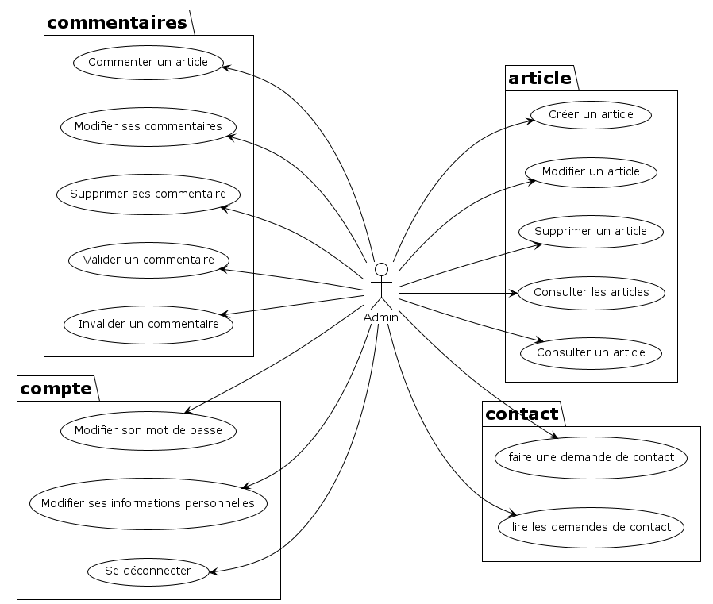

# Diagramme de classe

# Modèle de données

# Diagrammes de séquences
* ## Administration
  * ### Articles
    * <a href="../Diagrammes/SequenceDiagram/Administration/Article/create-article.png">création d'un article</a>
    * <a href="../Diagrammes/SequenceDiagram/Administration/Article/delete-article.png">suppression d'un article</a>
    * <a href="../Diagrammes/SequenceDiagram/Administration/Article/update-article.png">modification d'un article</a>
  * ### Commentaires
    * <a href="../Diagrammes/SequenceDiagram/Administration/Comment/valid-comment.png">valider un commentaire</a>
    * <a href="../Diagrammes/SequenceDiagram/Administration/Comment/invalid-comment.png">invalider un commentaire</a>

  * ### Contact
    * <a href="../Diagrammes/SequenceDiagram/Administration/Contact/delete-contact.png">Supprimer une demande de contact</a>
    * <a href="../Diagrammes/SequenceDiagram/Administration/Contact/read-contacts.png">Lire les demandes de contact</a>

  * ### Utilisateur
    * <a href="../Diagrammes/SequenceDiagram/Administration/User/delete-user.png">Supprimer un utilisateur</a>
    * <a href="../Diagrammes/SequenceDiagram/Administration/User/update-user.png">Modifier un utilisateur</a>

* ## Article
  * <a href="../Diagrammes/SequenceDiagram/Article/article.png">Voir un article</a>
  * <a href="../Diagrammes/SequenceDiagram/Article/articles.png">Voir tous les articles</a>

* ## Commentaires
    * <a href="../Diagrammes/SequenceDiagram/Comment/add-comment.png">Ajouter un commentaire</a>
    * <a href="../Diagrammes/SequenceDiagram/Comment/delete-comment.png">Supprimer un commentaire</a>
    * <a href="../Diagrammes/SequenceDiagram/Comment/update-comment.png">Modifier un commentaire</a>

* ## Contact
    * <a href="../Diagrammes/SequenceDiagram/Contact/create-contact-request.png">Créer une demande de contact</a>

* ## Mon compte
    * <a href="../Diagrammes/SequenceDiagram/MyAccount/update-password.png">Modifier mon mot de passe</a>
    * <a href="../Diagrammes/SequenceDiagram/MyAccount/update-profile.png">Modifier mon profil</a>

* ## Autres
    * <a href="../Diagrammes/SequenceDiagram/login.png">Connexion</a>
    * <a href="../Diagrammes/SequenceDiagram/logout.png">Déconnexion</a>
    * <a href="../Diagrammes/SequenceDiagram/register.png">Inscription</a>

# Cas d'utilisation

* ## Administrateur

* ## Utilisateur (connecté)

* ## Visiteur (non-connecté)

